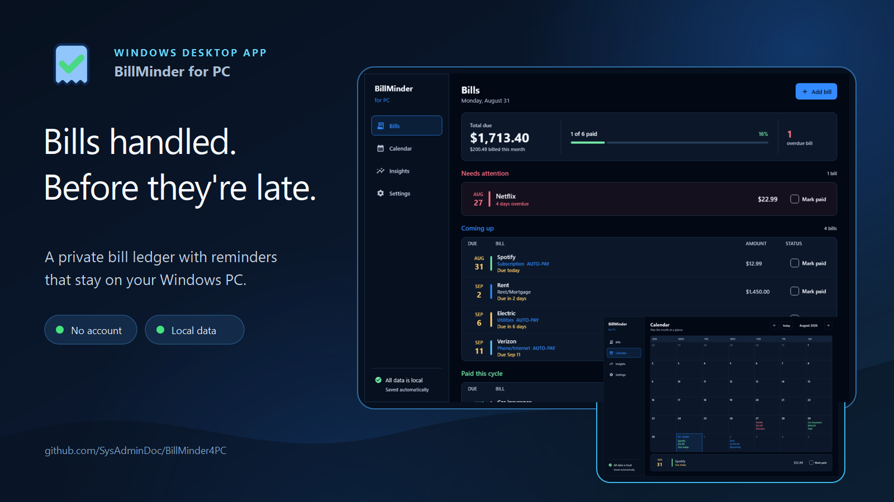
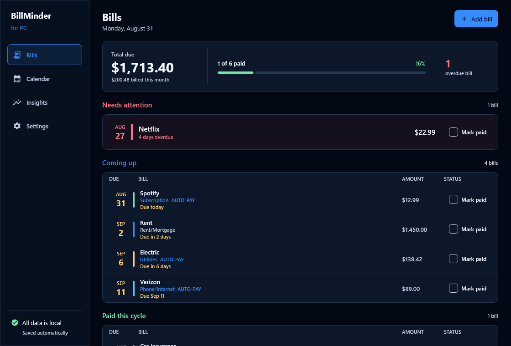
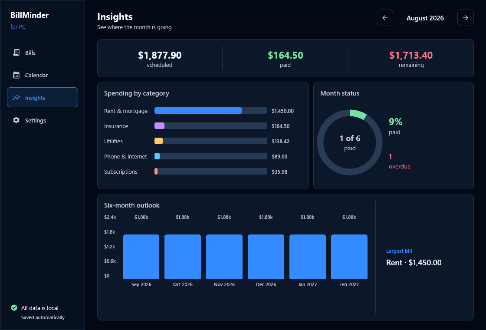
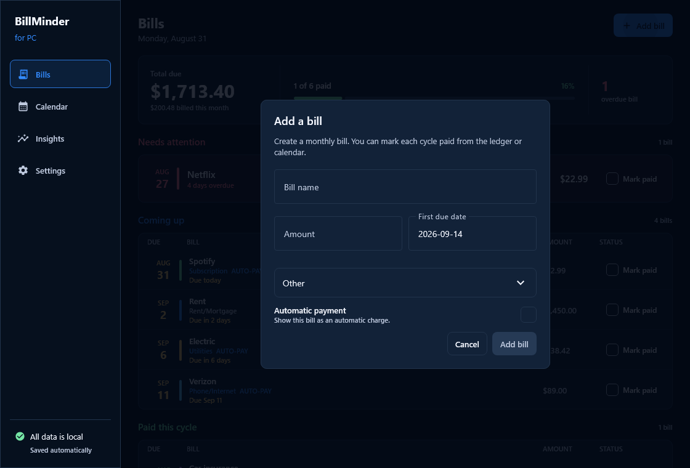
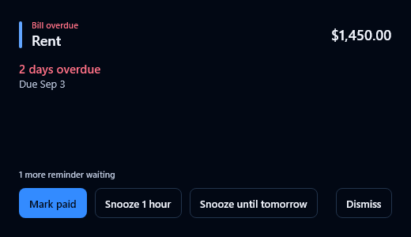

<p align="center">
  
  
  
</p>

<p align="center">
  <a href="https://ko-fi.com/X8K126YVER">
    
  </a>
</p>

<p align="center">
  <sub><em>If this project helps you, a coffee helps me keep working on it.</em></sub>
</p>

# BillMinder for PC

BillMinder keeps due dates visible and reminds you before a bill becomes a late fee. It lives in the Windows tray, works without an account, and stores its SQLite database on your own PC.

> [Download the Windows installer](https://github.com/SysAdminDoc/BillMinder4PC/releases/latest)

This is the desktop companion to [BillMinder for Android](https://github.com/SysAdminDoc/BillMinder). The apps share a recurrence model and a visual identity, while the desktop interface is built for a larger screen.

## See the month before it gets expensive



| Calendar | Insights |
| --- | --- |
|  |  |

| Add a bill | Get a reminder |
| --- | --- |
|  |  |

## What it handles

- Groups overdue, upcoming, and settled bills in one ledger.
- Places recurring bills on a month calendar and lets you pay from the selected day.
- Tracks category totals, payment progress, and the next six months.
- Raises tray reminders that can mark a fixed bill paid, snooze it, or dismiss it.
- Keeps snoozes accurate through sleep and clock changes.
- Supports variable amounts without quietly recording an estimate as the final payment.
- Starts at sign-in from an installed copy and stays available in the tray.
- Makes verified rolling backups and preserves the database it replaces during a restore.
- Can hide amounts in the window and keep bill details out of notifications.

Your data lives at `%LOCALAPPDATA%\BillMinder4PC\billminder.db`. There is no hosted account or subscription.

## Current limits

Reminders use a tray balloon and a focused reminder pane. Native Action Center actions are still planned. Bill editing, year view, import, and local-network phone sync are tracked in [ROADMAP.md](ROADMAP.md).

## Build it

JDK 21 is required.

```powershell
.\gradlew.bat build
.\gradlew.bat :desktop:run
.\gradlew.bat :desktop:packageReleaseMsi
```

Installers land under `desktop/build/compose/binaries/`. The screenshot test renders the interface offscreen through Skia, so the product images can be refreshed without opening windows on the active desktop.

## Project layout

| Module | Purpose |
| --- | --- |
| `core` | Recurrence rules and bill models with no UI dependency. |
| `data` | Room database, repository, snapshots, and local logging. |
| `desktop` | Compose Desktop interface, tray behavior, reminders, and Windows packaging. |

## License

MIT. See [LICENSE](LICENSE).
