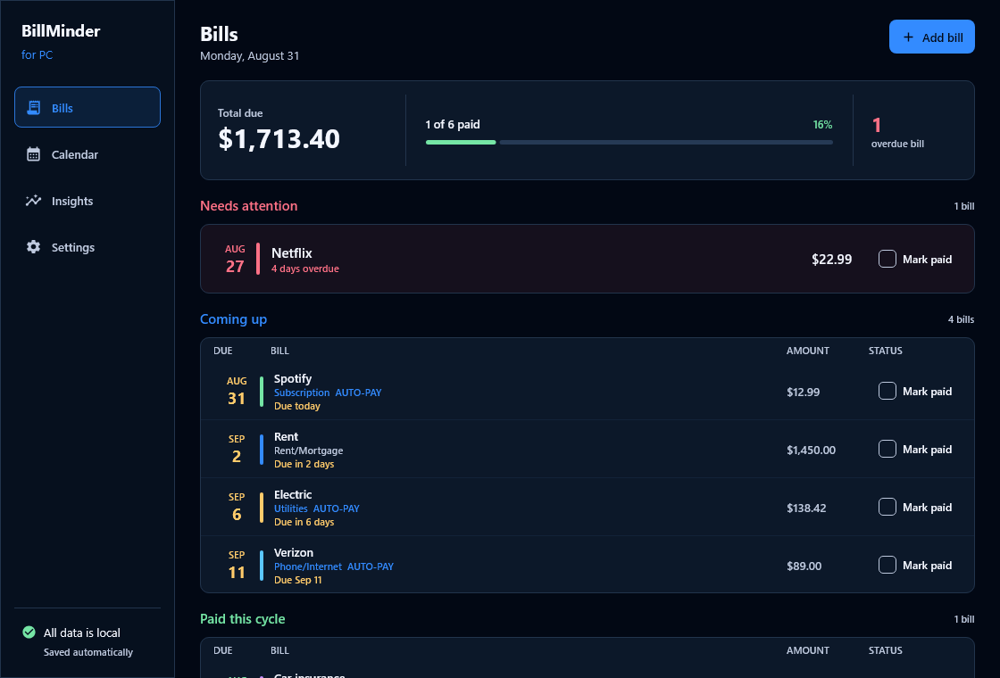
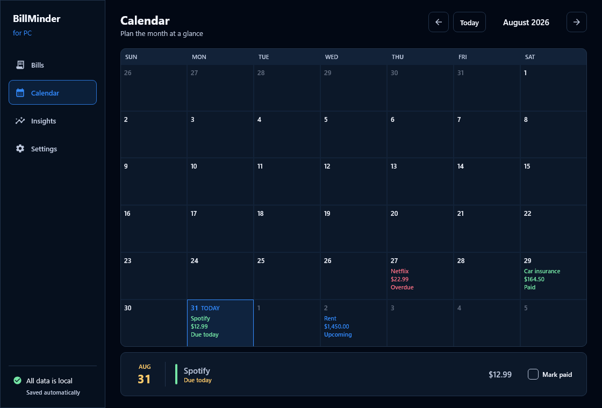
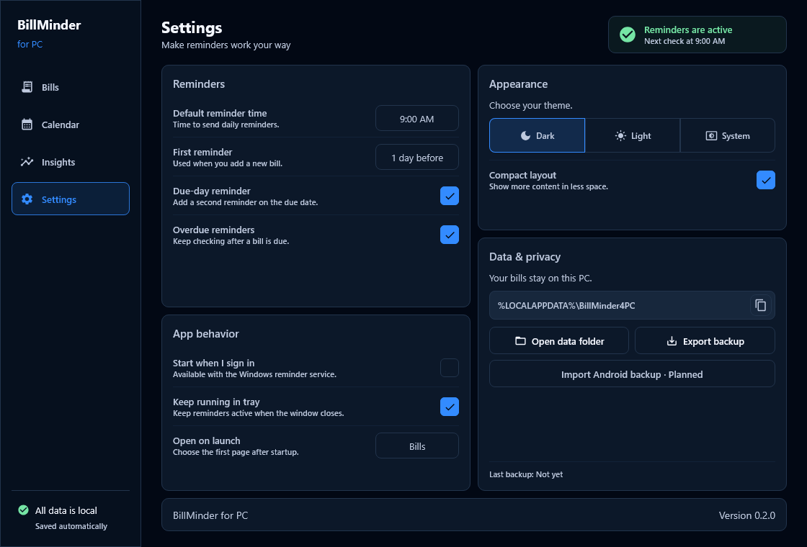

<p align="center">
  
  
  
</p>

# BillMinder for PC

A bill tracker for Windows that actually tells you when something is due.

Most desktop finance software is a ledger that happens to store due dates. You open it on a Sunday, sit down with it, and reconcile. That's a fine way to do accounting and a terrible way to avoid a late fee. BillMinder for PC is built the other way round: its job is to interrupt you at the right moment and let you clear the bill in one click.

It keeps everything in a single SQLite file on your own machine. No account, no server, no Docker, no subscription.

This is the desktop companion to [BillMinder for Android](https://github.com/SysAdminDoc/BillMinder). The two share a recurrence engine and a data format, but the desktop app is its own product with a layout built for a large screen and a keyboard.

## Status

Version 0.2.0 is an early but usable desktop build. Bills, Calendar, Insights, and Settings all render live local data. The app can add bills, settle them from the ledger or calendar, remember appearance and reminder preferences, and export a local backup. Windows notification delivery isn't built yet, though the wall-clock scheduler already computes reminder events. See [ROADMAP.md](ROADMAP.md).



| Calendar | Insights |
| --- | --- |
|  |  |



## What's here now

- Bills grouped into what needs attention, what's coming up, and what's settled
- A month calendar with bills inside each day and a selected-day payment action
- Category totals, payment progress, and a six-month outlook
- Reminder time, theme, density, launch-page, tray, and local-data controls
- A basic monthly bill form plus local ZIP backups
- One-click mark paid and undo, resolved against the correct billing cycle
- The recurrence engine from the Android app, anchor dates and all, with 27 tests covering it
- A local database at `%LOCALAPPDATA%\BillMinder4PC\billminder.db`
- Sample bills on first run so a fresh install isn't an empty screen
- A Windows tray badge with the due count and a tooltip showing today's bills
- Tray quick pay for the next fixed bill, with the amount form preserved for variable bills
- A wall-clock reminder scheduler that catches events crossed while Windows was asleep

## What's coming

Windows toast notifications are next. They will add Mark Paid and Snooze buttons to the tray-resident process.

The next app passes will expand bill editing, add the calendar year view, and extend the forecast. Keyboard-driven entry, printable statements, OFX and QFX import, and an Outlook-friendly ICS feed remain on the roadmap. Phone sync will use the local network with no cloud account.

## Building

You need JDK 21. Packaging needs JDK 17 or newer because it runs `jpackage`.

```bash
./gradlew build          # compile everything and run the tests
./gradlew :desktop:run   # launch the app
./gradlew packageMsi     # build the Windows installer
```

Installers land in `desktop/build/compose/binaries/`.

The screenshots in this README are generated, not captured by hand. `./gradlew :desktop:test` renders every page offscreen through Skia. The same test also exercises the main payment, add-bill, and settings controls against real database state.

## Layout

| Module | What it holds |
| --- | --- |
| `core` | The recurrence engine, the bill and payment models, and the pure math. No database, no UI, no platform calls. |
| `data` | Room 3 schema, DAO, and the repository. Uses the bundled SQLite driver so the engine version doesn't depend on the host. |
| `desktop` | Compose Multiplatform UI, theming, and the application entry point. |

`core` is deliberately dependency-free apart from Room's annotation artifact, which carries no runtime behaviour. That keeps the cycle math testable without spinning up a database.

## Why a separate repo

The Android app and this one share a problem domain, not a codebase. Sharing the UI layer would produce a phone app stretched across a monitor, which is the failure mode of most cross-platform ports. What they do share is the recurrence engine, and the copy here is kept honest by porting the Android test suite alongside it rather than by a build-time dependency.

## License

MIT. See [LICENSE](LICENSE).
