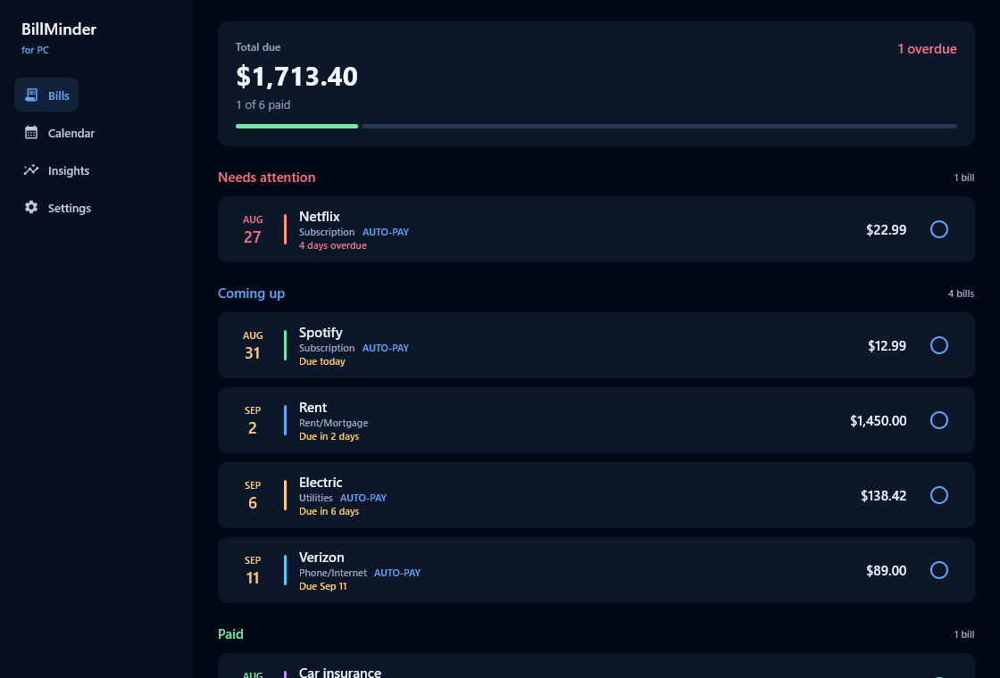

<p align="center">
  
  
  
</p>

# BillMinder for PC

A bill tracker for Windows that actually tells you when something is due.

Most desktop finance software is a ledger that happens to store due dates. You open it on a Sunday, sit down with it, and reconcile. That's a fine way to do accounting and a terrible way to avoid a late fee. BillMinder for PC is built the other way round: its job is to interrupt you at the right moment and let you clear the bill in one click.

It keeps everything in a single SQLite file on your own machine. No account, no server, no Docker, no subscription.

This is the desktop companion to [BillMinder for Android](https://github.com/SysAdminDoc/BillMinder). The two share a recurrence engine and a data format, but the desktop app is its own product with a layout built for a large screen and a keyboard.

## Status

Early. Version 0.1.0 is a working scaffold: the recurrence engine is ported and passing its full test suite, the database layer runs on Room 3 with a bundled SQLite build, and the ledger view reads and writes live data. The reminder system, the calendar, and the insights pages aren't built yet. See [ROADMAP.md](ROADMAP.md).



## What's here now

- Bills grouped into what needs attention, what's coming up, and what's settled
- One-click mark paid and undo, resolved against the correct billing cycle
- The recurrence engine from the Android app, anchor dates and all, with 27 tests covering it
- A local database at `%LOCALAPPDATA%\BillMinder4PC\billminder.db`
- Sample bills on first run so a fresh install isn't an empty screen

## What's coming

The reminder layer is the point of the whole thing, so it's next. Windows toast notifications with Mark Paid and Snooze buttons, fired from a tray-resident process that keeps working when the window is closed.

After that: a month calendar that shows bills inside the day cells rather than as dots, cash-flow projection, keyboard-driven entry, bulk edit, printable statements, OFX and QFX import, and an ICS feed you can subscribe to from Outlook. Sync with the phone over your own network, with no cloud account, is the longer-term goal.

## Building

You need JDK 21. Packaging needs JDK 17 or newer because it runs `jpackage`.

```bash
./gradlew build          # compile everything and run the tests
./gradlew :desktop:run   # launch the app
./gradlew packageMsi     # build the Windows installer
```

Installers land in `desktop/build/compose/binaries/`.

The screenshot in this README is generated, not captured by hand. `./gradlew :desktop:test` renders the UI offscreen through Skia and writes a PNG, which means it doubles as a smoke test that the whole screen composes against real database state.

## Layout

| Module | What it holds |
| --- | --- |
| `core` | The recurrence engine, the bill and payment models, and the pure math. No database, no UI, no platform calls. |
| `data` | Room 3 schema, DAO, and the repository. Uses the bundled SQLite driver so the engine version doesn't depend on the host. |
| `desktop` | Compose Multiplatform UI, theming, and the application entry point. |

`core` is deliberately dependency-free apart from Room's annotation artifact, which carries no runtime behaviour. That keeps the cycle math testable without spinning up a database.

## Why a separate repo

The Android app and this one share a problem domain, not a codebase. Sharing the UI layer would produce a phone app stretched across a monitor, which is the failure mode of most cross-platform ports. What they do share is the recurrence engine, and the copy here is kept honest by porting the Android test suite alongside it rather than by a build-time dependency.

## License

MIT. See [LICENSE](LICENSE).
